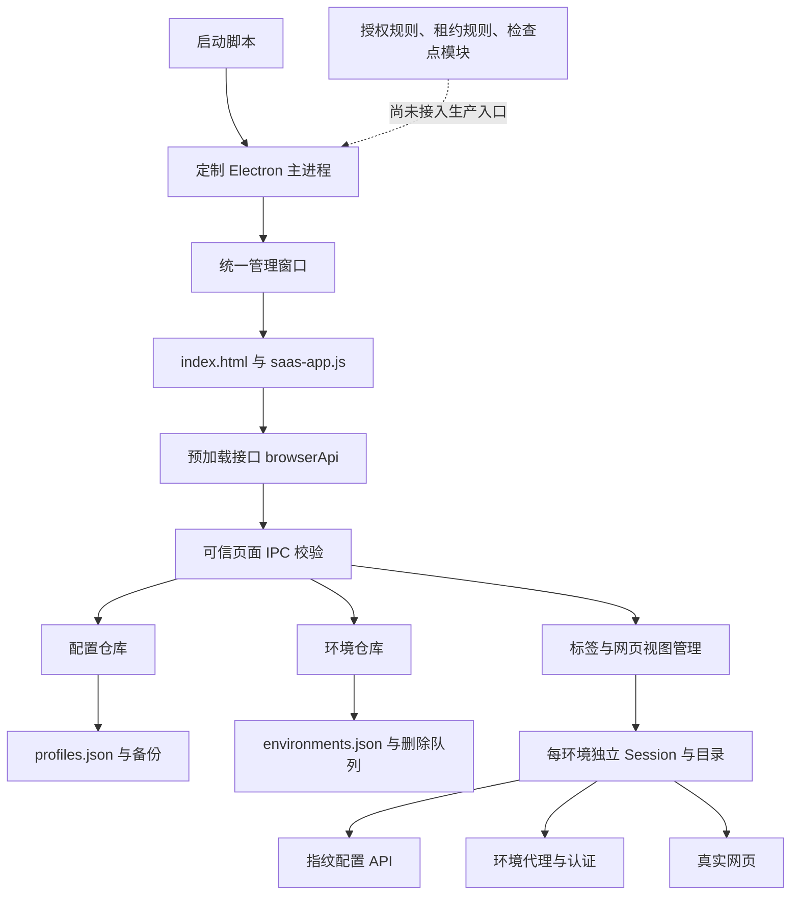
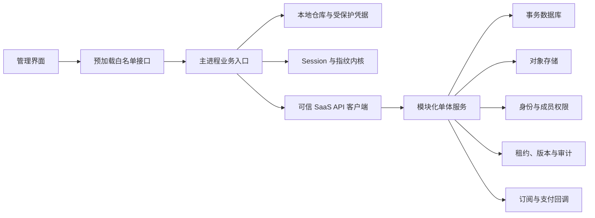
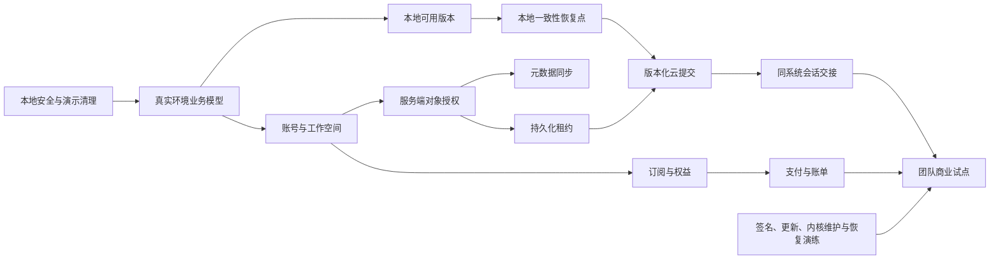

# 栖界指纹浏览器：SaaS 系统现状分析与下一步开发计划

分析日期：2026-10-04（北京时间）  
代码基线：`3b0acfd59f5c136945543aed488eff5d2f0b17ee`  
应用版本：`0.1.0`  
分析方式：业务源码审阅、调用链追踪、现有测试重新执行、边界验证、发行清单与界面截图核对。  
文档性质：开发基线与实施计划。本文没有修改业务代码，所有建议任务均应按验收条件实施后才能标记完成。

阅读建议：判断现状先读第一、四、八章；安排开发读第十二至十四章；设计接口与迁移读第九至十一章；测试与上线读第十五至十八章。第十三章共有 59 项开发任务，第四章单独登记 23 项演示与数据断点，第八章登记 18 项问题及修复要求。

## 一、结论与下一步方向

### 1.1 当前系统处于什么阶段

当前项目已经具备可运行的 Windows 本地指纹浏览器基础，但仍处于“真实本地客户端与 SaaS 设计原型混合”的阶段。

可以确认已经接通的主链路是：

> 创建配置 → 保存配置 → 创建独立环境 → 设置独立代理及指纹 → 打开真实网页 → 关闭并保存 → 重启后恢复。

当前不能确认已经成立的 SaaS 主链路是：

> 真实账号 → 真实工作空间 → 服务端成员与授权 → 多设备占用控制 → 云端版本与会话交接 → 服务端订阅权益 → 支付与账单。

仓库内有授权、邀请码、租约和检查点的领域规则及测试，但这些模块没有接入生产主进程业务入口，没有云端持久化，也没有真实身份来源。它们是可以复用的开发基础，不能计入已交付的团队协作能力。

因此，下一步不能只把页面上的数组换成接口。需要同时解决数据真实性、业务对象缺失、操作事务边界、权限边界、异常恢复和服务端状态来源。

### 1.2 优先级建议

1. **先处理本地安全与真实性。** 修复删除路径边界、网页权限默认放行、管理页文本注入、空环境诊断、种子复用和创建失败残留；将生产入口中的演示数据改为真实状态或明确的未开放状态。
2. **完成本地产品闭环。** 持久化分组、环境名称与网络配置；接通代理资源、诊断、审计、设置、指纹摘要、分页和导入导出。
3. **建设 SaaS 最小服务端。** 账号、设备、工作空间、成员、对象授权和元数据同步先行，先形成真实团队业务闭环。
4. **在服务端权限和版本提交可靠后开放会话交接。** 先验证同系统场景，分清元数据、Cookie、数据库目录和密码的不同迁移边界。
5. **最后完成计费和商业交付。** 订阅权益必须来自服务端，支付成功必须由回调验证；签名、自动更新、安全内核维护和恢复演练成为上线门槛。

不建议在这一轮顺带重写前端框架、重做全部视觉或引入微服务。当前最缺的是完整可信的业务链路。

### 1.3 本轮分析发现的优先阻断项

| 优先级 | 问题 | 当前影响 |
| --- | --- | --- |
| P0 | 删除路径验证没有完整约束环境编号 | 异常记录可以将清理目标指向整个环境目录甚至应用数据根目录 |
| P0 | 网页权限处理器除外部协议外一律返回允许 | 摄像头、麦克风等权限缺少应用层的按来源确认；现有测试还固定期待媒体权限允许 |
| P0 | 首页直接插入未转义环境名称 | 用户输入可被解释为管理页 HTML，影响界面可信性和操作边界 |
| P0 | 页面宣称实时数据，但仍混入固定身份、异常、代理、账单和活动 | 用户无法准确区分真实运行结果与设计内容 |
| P0 | 分组、负责人、云同步选项没有完整保存和生效 | 表单承诺与实际行为不一致；云同步选项可选但不会上传 |
| P0 | 默认新配置共用固定指纹种子 | 独立目录不等于独立指纹；界面“每环境生成种子”的描述不成立 |
| P0 | 同一环境并发恢复缺少进行中的互斥状态 | 顺序打开测试通过，但并发时存在重复网页视图和记录覆盖风险 |
| P0 | 环境重开使用最近访问页面而不是创建地址 | 用户关闭环境后再次打开会回到最后浏览页面，不符合“启动网址”语义 |
| P0 | AdsPower 指纹检测页报告 WebGL 异常 | 当前 WebGL 配置、运行时输出或像素检测链路存在不一致，指纹能力不能对外宣称通过 |
| P1 | 创建配置、创建环境、打开网页是多个独立提交 | 网络失败可能留下无环境的配置；网页失败又可能保留真实环境但界面提示创建失败 |
| P1 | 检查点、授权和租约仅停留在独立模块 | 页面上的恢复点、权限和占用状态没有对应运行链路 |
| P1 | 当前构建工作流没有真正执行指纹客户端构建和回归 | 本机通过与持续集成通过不能互相替代 |

P0 表示下一轮必须优先处理；P1 表示开放对应功能或团队测试前必须完成；P2 表示核心链路稳定后的改进。任务优先级不等于本次已修复。

## 二、分析范围与证据口径

### 2.1 本次覆盖范围

- `fingerprint-browser`：主进程、预加载接口、SaaS 页面、旧管理页与旧浏览器页、配置与环境仓库、代理、数据目录、授权、租约、检查点、测试和打包脚本。
- `fp-kernel`：版本清单、配置协议、支持矩阵、补丁登记、集成与发行说明。
- `shell/browser/fingerprint`、Session API、浏览器进程中的指纹与 WebRTC 接入入口，以及相关定向测试。
- `.github/workflows/fp-validate.yml` 与 `fp-build-windows.yml`：当前指纹专用持续集成边界。
- 现有商业规划、统一工作台规划和实施记录，并与实际入口进行交叉核对。
- 当前发行目录中的版本清单、安装器签名状态，以及重新生成的统一工作台截图。

本次没有重新编译 Chromium，没有执行真实支付、发送邀请或上传用户数据，没有修改已有配置与登录目录，也没有进行安装卸载验证。

### 2.2 完成状态必须区分四个层次

| 状态 | 判断标准 |
| --- | --- |
| 已接通并验证 | 生产入口可达，读取或写入真实数据，且有本次或明确对应产物的测试证据 |
| 已实现但未接通 | 存在业务规则与测试，实际客户端或服务端没有调用 |
| 演示或占位 | 固定数组、固定文案、仅内存修改、仅弹窗预览、仅界面切换 |
| 未实现或待验证 | 没有对应业务链路，或存在源码但缺少当前运行时、平台及场景的验证 |

“文件存在”“界面有按钮”“文档标记完成”“测试进程返回成功”均不能单独证明一个 SaaS 功能已交付。

### 2.3 分析边界

- 在本仓库的产品目录中没有发现真实 SaaS API 服务、数据库访问、身份服务或支付回调实现。这不代表用户在其他仓库没有相关系统；接入前需要核对外部资产。
- Electron 上游目录中的网络、数据库、更新 API 和测试基础设施，不自动构成栖界产品已经实现的对应业务功能。
- 当前代码与发行清单以 Windows x64 为可确认基线。macOS 两架构和 Linux 的路径分支存在，但不能据此声明已完成发行。
- 内核部分采用源码与现有登记作为证据；本次没有重新运行全部内核定向测试，也没有对第三方指纹网站做全面验证。
- 本次新增的问题验证使用内存对象、虚拟文件系统或隔离测试目录。并发网页视图问题在虚拟运行时重现，仍需加入真实运行时回归。

## 三、实际架构与主要调用链

### 3.1 当前运行架构

当前系统本质上是桌面应用：界面经 IPC 调用本机可信业务代码，本地 JSON 文件保存配置和环境记录，环境会话位于独立目录中。当前没有页面到 SaaS 服务端的真实请求链路。

### 3.2 当前权威入口

| 文件或目录 | 实际职责 | 状态与注意事项 |
| --- | --- | --- |
| `scripts/start.js` | 选择运行时与数据目录并启动应用 | 默认使用本地 Release，兼容显式运行时配置 |
| `main.js` | 初始化、单实例、仓库、窗口和 IPC | 当前 SaaS 主入口；没有调用授权、租约或检查点模块 |
| `preload.js` | 暴露配置、环境、标签方法与事件 | 没有账号、团队、代理资源、审计、订阅或设置接口 |
| `renderer/index.html` | 统一工作台静态外壳 | 加载 `saas-app.js` 与 `saas.css`；静态身份与配额仍是演示 |
| `renderer/saas-app.js` | 七个主页面、向导、抽屉、统一标签交互 | 环境链路真实；大量旁支保留设计数据 |
| `renderer/app.js`、`styles.css` | 旧管理界面的编辑、分页和批量逻辑 | 当前 `index.html` 不加载；不能将其能力算作当前 SaaS 页面能力 |
| `renderer/browser.html`、`browser.js`、`browser.css` | 旧独立浏览器工具栏 | 当前窗口入口没有加载它；历史模型需与单窗口模型区分 |
| `profile-store.js` | 配置规范化、校验、默认模板、代理和网址校验 | 返回固定字段，新增业务字段会丢失；内核主版本硬编码为 138 |
| `profile-repository.js` | 配置原子保存、备份、写入队列和修订冲突 | 可复用，不能直接替代多租户服务端事务 |
| `environment-repository.js` | 环境记录、迁移、更新、删除及延迟清理 | 只支持运行/关闭；缺少业务分组、同步与异常状态 |
| `browser-tabs.js` | 会话、代理、网页视图、导航、关闭和状态通知 | 已接通；缺少打开中的互斥、完整权限与下载管理 |
| `socks5-proxy.js` | 本机 SOCKS5 认证转接 | 支持真实认证和上游域名解析；生命周期已有回归 |
| `runtime-compat.js` | 检查指纹 API、避免替换锁定快照、旧内核兼容 | 能力兼容层可复用，但不是完整能力探测 |
| `workspace-access.js` | 角色、对象范围、邀请码生命周期 | 仅规则与内存状态，主进程没有使用 |
| `workspace-lease.js` | 租约、续期、提交令牌和释放 | 仅内存实现，不能控制不同机器或服务重启后的占用 |
| `environment-checkpoint.js` | 文件清单、大小、哈希、平台和版本校验 | 不包含归档、传输、恢复或浏览器存储静止处理 |
| `scripts/package.ps1`、`installer.nsi` | Windows 安装包、便携包、品牌资源和清单 | 已有真实产物；签名与自动更新未接通 |
| `product-plan/2026-10-03` | 高保真原型、规划、研究与设计图 | 历史设计资产，可以保留演示数据，但必须与生产入口隔离 |

### 3.3 必须统一的产品模型

以 2026-10-04 的实际入口为基准：**一个统一窗口、固定首页、一个环境一个网页标签**。

`openPageTab()` 当前会选中已有环境标签；旧文档中的“一个环境多个网页标签”和 `browserPage()` 中的示例业务标签，已经不代表当前产品规则。

下一轮应统一界面、帮助、测试和文档口径。未来若确实需要登录弹窗或环境内多个页面，应单独决策其会话归属，不在本轮默默恢复旧模型。

## 四、逐页功能与演示数据清单

### 4.1 模块现状总表

| 模块 | 已接通部分 | 演示、缺失或失实部分 | 下一步 |
| --- | --- | --- | --- |
| 工作台 | 环境总数、运行数来自本机环境记录 | 问候身份、分组数、异常卡片、团队动态、配额上限固定 | 建立真实概览查询；无数据使用空态 |
| 环境列表 | 真实列表、搜索、状态筛选、勾选、批量开关、删除 | 分组不能保存；分页外壳无逻辑；异常页签数量固定；负责人投影为“我” | 持久化元数据，接通分页与诊断状态 |
| 创建向导 | 真实直连、HTTP/SOCKS5、代理认证、配置保存和网页启动 | 分组/负责人/云保存不生效；第三步指纹不能自定义编辑；摘要固定；默认种子固定 | 统一创建业务操作；自动生成可编辑指纹草稿，摘要与保存内容一致 |
| 环境详情 | 部分名称、运行状态、时间和本地环境记录真实 | 模板修订、权限、活动、诊断时间、请求编号及部分同步信息固定 | 真实详情、指纹快照、授权和活动分阶段接入 |
| 代理资源 | 创建向导中的代理配置真实 | 本页五条代理全是演示；检查只显示提示；添加和导入仅预览 | 真实代理仓库、检查记录与绑定关系 |
| 团队成员 | 无真实团队业务 | 五个成员固定；邀请只追加内存数组；没有真实授权 | 接入身份、工作空间、成员和邀请服务 |
| 操作记录 | 无真实产品审计流水 | 七条固定记录；筛选与导出只展示说明 | 本机记录先行，再接服务端权威审计 |
| 订阅与用量 | 环境数量引用本机数据 | 套餐、价格、有效期、成员、空间和上限均为占位 | 未接通前隐藏购买；之后服务端权益与账单驱动 |
| 设置 | 数据目录规则在后台真实存在 | 设备、版本、恢复点开关、迁移、更新和诊断包未接通 | 真实能力与持久化设置；操作先预览再执行 |
| 统一标签栏 | 真实网页、导航、切换、关闭、指纹提示 | 加载失败状态未充分展现，快捷键仍有旧页面条件 | 接入网页加载/错误状态与全局快捷键 |
| 示例环境浏览器页 | 可经历史路由渲染设计页面 | 示例订单、趋势、下载和权限预览；与真实标签规则冲突 | 生产路由移除或重定向到真实环境标签 |

### 4.2 生产入口中的演示与断点台账

以下行号基于上述提交；源码变更后应按函数名重新定位。

| 编号 | 位置 | 具体内容 | 推荐处理 |
| --- | --- | --- | --- |
| 演示01 | `renderer/index.html:23` | 品牌“设计稿”、远航团队、团队版空间 | 替换为真实本地工作空间状态；不要只删“设计稿”标签后继续显示假身份 |
| 演示02 | `renderer/index.html:27`、`:29` | 默认 `8 / 300`、固定进度条、林沐与所有者身份 | 全部来自同一身份及权益快照；加载前不能显示演示值 |
| 演示03 | `saas-app.js:43`，`members` | 五个固定姓名、邮箱、角色和活跃时间 | 生产不初始化样例成员；无服务端时展示“团队功能未开放” |
| 演示04 | `saas-app.js:60`、`:64` | 默认业务名称、业务分组和示例网址 | 名称默认留空；网址可默认空白页；示例提示不得成为伪业务记录 |
| 演示05 | `saas-app.js:190`，`mapEnvironment()` | 所有分组变成未分组，负责人变成我，出口未检测、同步仅本地 | 前两项接入元数据；后两项是当前能力边界，应保留真实未知态 |
| 演示06 | `saas-app.js:330`，`metrics()` | 固定三分组、300 配额；进度至少 8%，未限制超过 100% | 改为真实统计；未知配额展示未提供；比例限制在 0%～100% |
| 演示07 | `saas-app.js:335`，`overview()` | 固定问候、已完成引导步骤、法国代理失败、日本同步失败、三条团队动态 | 概览统一来自真实事件和引导状态，零环境不显示异常 |
| 演示08 | `overview()`、`proxiesPage()` | 操作关联 `QJ-1003`、`QJ-1006` | 不允许生产动作绑定假编号；查找不到时提示对象不存在，禁止回退其他环境 |
| 演示09 | `saas-app.js:348`，`environmentPage()` | “需要处理 2”、三个固定分组和假的 20 条分页 | 使用真实状态计数、真实分组和真实页码 |
| 演示10 | `createPage()` 第一步 | 负责人无字段名，分组与存储仅进入草稿 | 保存真实元数据；未实现的云同步选项禁用并说明 |
| 演示11 | `createPage()` 第三步 | 指纹只读；Windows、屏幕、推荐模板修订、每环境种子、WebRTC 限制都是固定摘要 | 自动生成初始指纹并允许自定义支持字段；摘要跟随编辑；默认 WebRTC 模块当前是关闭 |
| 演示12 | `saas-app.js:364`，`proxiesPage()` | 五个保留地址代理、地区、延迟、绑定数、结果和时间固定 | 建立真实资源列表和检测历史；无资源时提供空态 |
| 演示13 | `saas-app.js:368`，`membersPage()` | 席位 `5 / 10` 固定，角色权限只有解释 | 从服务端加载成员及邀请；权限在后端落实 |
| 演示14 | `saas-app.js:371`，`auditPage()` | 七条固定审计事件 | 操作真实写入；没有事件时显示空列表 |
| 演示15 | `saas-app.js:375`，`billingPage()` | 99/299/899 元、配额、到期日、1.2 GB 用量和有效状态 | 移出生产订阅状态；报价与支付接通前不展示为已购买 |
| 演示16 | `saas-app.js:379`，`settingsPage()` | 演示设备、默认恢复点开启、商业版设计稿、运行时未连接 | 显示真实设备及版本；恢复点只有流程接通后才能开启 |
| 演示17 | `saas-app.js:382`，`browserPage()` | 示例业务后台、订单与趋势、假导航、环境内多标签说明 | 生产不保留可误入的伪浏览器页 |
| 演示18 | `saas-app.js:386`，`detailDrawer()` | 来源修订 1、创建活动、分组权限、固定诊断、假请求编号 | 全部引用真实快照、审计与检查结果；空对象使用空态 |
| 演示19 | `saas-app.js:412`，`onboarding()` | 设置工作空间提交后只跳转，不保存工作空间 | 改为真实本地命名流程；团队创建等待服务端接通 |
| 演示20 | 点击处理器约 `:469`、`:470` | 检查代理固定提示 4 可用/1 失败；邀请只构造弹窗 | 真正调用对应业务；未开放动作不能提示完成 |
| 演示21 | 点击处理器约 `:480`、`:487`～`:499` | 开关只改界面；下载、导入、诊断导出、迁移、更新等只弹说明 | 接通前明确禁用；按模块接通后返回实际结果 |
| 演示22 | 提交处理器约 `:538`～`:556` | 真正保存的只有名称、网址、代理；未提交分组、负责人和存储方式 | 扩展环境创建契约并保持兼容；云模式不得静默按本地创建 |
| 演示23 | 提交处理器 `:564`～`:565` | 邀请只向数组追加，工作空间设置不持久化 | 删除生产中的模拟写入，替换为真实服务或未开放状态 |

### 4.3 哪些演示数据应保留

历史原型、设计图、自动化测试中的样例地址与模拟服务可以保留。`example.com`、`.invalid`、文档保留 IP 以及测试用模拟失败，本身不等于生产缺陷。

清理应针对“生产入口将演示内容解释为真实业务”的情况，不采用全仓库删除 `demo`、`mock`、中文说明或测试数据的方式。

建议规则：

- 生产构建只能导入生产业务模块，不依赖 `product-plan` 原型脚本。
- 设计稿保留在现有目录，保留中文注释及说明。
- 业务结果只能由真实操作成功返回后显示；未接通显示“暂未开放”，查询失败显示“暂时无法读取”，不能回填样例数据。
- 样例数据不作为默认数据库种子。开发演示如后续有需要，应显式启用并使用隔离目录。

## 五、真实业务流程与当前缺口

### 5.1 新建环境

当前实际顺序：

1. 向导收集名称、网址、代理，以及尚未生效的分组和保存方式。
2. 请求默认配置草稿；当前不能真正选择或编辑向导中展示的高级指纹。
3. 修改草稿名称、网址和代理。
4. 保存到 `profiles.json`。
5. `profiles:launch` 根据配置创建环境目录与快照，写入 `environments.json`。
6. 初始化 Session，设置代理、指纹与网页权限处理器。
7. 创建网页视图，先标记运行中，再等待网址加载。
8. 查询环境列表，根据来源配置或名字寻找新环境。

缺口：

- “创建业务环境”和“创建可复用模板”绑在一起；每建一个环境都会新增一份配置，删除环境却保留配置。
- 保存模板后代理检测失败，环境可能被清理，但刚保存的配置没有回滚。
- 网页视图已建立后目标网页加载失败，代码会保留标签和环境，但仍返回失败；用户重试可能再次创建。
- 同名环境以名称兜底查找，不能保证找到本次操作结果。
- 分组和云保存选择不进入实际创建契约；负责人字段甚至没有提交字段。
- 默认指纹种子固定；新增环境并未在创建时生成独立种子。

建议：建立主进程的“创建环境”单一业务入口，返回明确环境 ID、创建结果和启动结果。环境创建成功但网页未加载时，应显示“环境已创建，网页加载失败，可重新打开”，而不是引导用户再次创建。

#### 5.1.1 新增需求：第三步自动生成指纹，并允许自定义修改

需求确认日期：2026-10-04。用户要求将第三步从不可修改的自动指纹摘要改为“自动生成初始值，用户可按需修改后创建”。对应新增任务 **A13**，优先级 **P0**，纳入 M0。

交互与数据规则：

1. 每次开始创建环境时生成一份适配当前运行时的初始指纹草稿；第三步展示实际草稿，默认参数可直接使用，也可自定义修改。
2. 支持字段按基础参数、设备与屏幕、图形、噪声和模块开关分组编辑；高级参数可折叠，不能只展示不可操作的摘要。
3. 自动生成只负责填充初始值。修改后切换步骤、刷新摘要或普通重新渲染，不得重新生成并覆盖用户输入；创建前再次获取默认草稿，也不能覆盖已编辑指纹。
4. 提供显式“重新生成”和“恢复推荐值”操作，覆盖已有修改前提示确认；这些操作只调整指纹草稿，保留环境名称、分组、网址和代理设置。
5. 摘要即时反映最终草稿。校验失败应定位具体字段，并用中文解释原因；主进程使用现有配置校验再次检查，非法参数不得创建环境或静默替换为默认值。
6. 创建保存、环境快照及 `setFingerprintConfig()` 使用同一份通过校验的最终配置，不能出现“界面自定义、后台仍保存默认值”。
7. 自动生成的实例种子保持独立；用户显式填写种子时保留其合法输入。创建操作不得再次无条件生成种子覆盖自定义值，重复种子可以提示，但不能静默更改。
8. 创建后的环境继续遵守稳定快照规则：关闭、重开及进程重启使用已保存的自定义指纹；修改模板或新建草稿不改变已有环境。此任务不包含已创建环境的指纹热更新。
9. 优先复用旧管理页的字段映射、现有配置校验和公开指纹接口；仅修改应用层，不触发 Chromium/Electron 原生编译。

| 参数组 | 第三步编辑范围 | 校验与能力边界 |
| --- | --- | --- |
| 浏览器与语言 | 用户代理、请求语言、主要语言、语言列表、时区 | 语言及时区格式合法；用户代理与客户端提示组合给出一致性提示 |
| 设备与屏幕 | 平台、线程数、设备内存、屏幕尺寸、可用尺寸、缩放 | 采用现有允许范围；可用尺寸不大于屏幕尺寸；平台字符串不代表完整跨系统支持 |
| 图形与噪声 | 图形厂商、渲染器、种子、Canvas/Audio/元素尺寸噪声开关 | 使用内核已支持字段；显示模块开关与噪声开关的共同生效条件 |
| 指纹模块 | 用户代理、客户端提示、语言、时区、设备、屏幕、图形、画布、音频、字体、WebRTC、调试器兼容 | 不支持的能力明确提示或禁用；不将配置保存成功等同于实测通过 |
| 实际运行时信息 | 应用、内核版本及配置协议版本 | 真实版本只读；不把当前内核不能执行的版本或未知字段伪装成可编辑能力 |

### 5.2 打开、重开与导航

已实现：读取原环境目录与快照，不套用模板最新版本；通过真实代理请求网页；运行中环境可定位已有标签。

缺口：

- `isOpen()` 只查看已经完成登记的标签，没有“正在打开”集合。两个并发请求可同时通过检查。
- 当前只保存 `open/closed`，缺少启动中、关闭中、崩溃和错误码；列表无法真实呈现“需要处理”。
- 页面加载错误写入标签快照，但环境列表不持久化诊断摘要，统一地址栏也未充分呈现错误。
- 最近使用直接取 `updatedAt`，而更新时间还用于关闭和导航；“最近使用优先”没有相应排序逻辑。
- 返回、前进、刷新与新加载的超时和失败呈现不完全一致。
- 环境记录只有可变化的 `lastUrl`，重开流程将它作为下一次加载地址；创建时的启动地址没有作为不可变字段保存。

建议：按环境 ID 复用进行中的打开操作，建立运行状态机；新增不可变的 `creationUrl`（或等价字段）保存创建时地址，关闭/重开始终加载该地址；`lastUrl` 只用于最近访问记录和详情展示；最近启动时间与元数据更新时间分开；网页错误和环境错误分层记录。

#### 5.2.1 新增需求：重开环境必须回到创建时地址

需求确认日期：2026-10-05。环境标签打开后可以在网页内导航，但关闭标签后再次打开同一环境时，必须加载创建环境时设置的启动地址，不得因为上次访问了其他页面而改变启动入口。对应新增任务 **A14**，优先级 **P0**，纳入 M0。

数据与行为规则：

1. 创建环境时将最终通过校验的启动地址写入不可变的 `creationUrl`；保留当前 `lastUrl` 记录最近一次实际访问地址，两者不能混用。
2. 首次打开、关闭后重开、客户端重启后恢复和从环境列表再次打开，统一使用 `creationUrl`。
3. 地址栏的后退、前进和手动导航只更新 `lastUrl`，不能自动改写 `creationUrl`。
4. 用户如果未来需要修改启动地址，必须通过明确的环境设置/编辑操作修改 `creationUrl`，并记录修订；本任务不把浏览过程中的导航视为修改。
5. 旧环境没有 `creationUrl` 时，以迁移时可确认的原始配置网址或旧版快照网址补齐；无法确认时使用安全空白页并提示，不得把最后访问地址静默当成创建地址。
6. 创建失败、代理失败或网页加载失败时，不能写入错误的地址覆盖 `creationUrl`；重试使用同一个环境 ID 和同一创建地址。

验收至少覆盖：创建地址为页面 A，导航到页面 B，关闭后重开仍进入页面 A；跨进程重启后仍进入页面 A；手动修改地址后 `lastUrl` 变为页面 B 但 `creationUrl` 保持页面 A；旧环境迁移不丢原始地址。

### 5.3 关闭与退出

已实现：刷新 Cookie 存储、写入关闭状态、关闭网页视图、释放 SOCKS5 转接和等待仓库写入。

边界：

- 刷新 Cookie 不等于所有 SQLite、IndexedDB、LevelDB 和 ServiceWorker 已形成可复制的一致快照。
- Session 仍可能被当前进程持有，关闭视图不自动证明所有目录文件已经解锁。
- 主动关闭失败时会保留标签；应用退出中的失败分支会继续关闭并记录日志，应明确告知是否存在未完成保存。
- 退出时后台数据事件会继续触发查询，本次回归日志出现多次“应用正在退出”的查询拒绝；属于生命周期收口任务。
- 没有任何生产入口调用 `createCheckpoint()`，设置中恢复点开关没有实际作用。

### 5.4 删除与恢复

已有删除确认、运行中先关闭、独立目录删除、Windows 目录占用时的延迟清理。

需要优先补齐：

- 所有删除入口共用严格环境编号和目录验证，不能只检查字符串拼接结果相等。
- 核对目录链接、路径分隔符、保留名称和根目录，尤其是延迟清理记录的入口。
- 环境列表提交与删除队列写入不是一个事务；队列写入失败时可能列表已删除但目录仍在。
- 重命名目录后、记录提交后、物理清理失败后的回滚状态必须一致。
- 备份是上一版记录，可能包含已经删除的环境；从备份恢复时必须结合删除标记与目录检查，不能复活已删除对象或默默迁移残留目录。
- 与配置仓库不同，环境仓库恢复损坏主文件后没有对应的损坏副本保留及恢复提示；结构非法主文件也不完整走备份恢复分支。

以上删除事务与备份组合属于源码发现的待补充故障回归，不能仅凭现有正常删除测试判定已可靠。

## 六、内核、指纹与跨平台现状

### 6.1 当前版本基线

| 项目 | 当前证据 |
| --- | --- |
| Electron | 37.2.6 |
| Chromium | 138.0.7204.185 |
| Node.js | 22.17.1，来自内核版本清单 |
| 指纹内核 | 0.1.0 |
| 指纹协议 | 第 1 版 |
| 已确认适配目标 | Windows x64 |
| 当前应用版本 | 0.1.0 |

版本清单说明目标版本，不自动证明所有发行包都包含相同补丁。正式能力报告必须绑定运行时哈希、源码提交、操作系统与测试结果。

### 6.2 已有内核基础

- Session 暴露设置、读取和清除指纹配置的方法。
- 配置挂在 Session 对应的浏览器上下文，首次 Renderer 创建后锁定，应用恢复时检查是否仍为原快照。
- 已有硬件、用户代理、客户端提示、语言、时区、平台、屏幕、图形信息、画布、音频、字体、元素尺寸、WebRTC 与调试器相关源码或补丁。
- 定向测试覆盖了无配置、不同 Session、模块关闭和部分 Worker/ServiceWorker 场景。

必须保留的限制：

- `getFingerprintConfig()` 返回保存配置，不是网页实际测量报告。
- 部分补丁在登记中仍为“已实现，待验证”，不能升级为当前发行包已全部通过。
- WebGL 像素处理目前有格式限制；字体是代表性过滤，并非完整系统字体一致性。
- 2026-10-05 使用 `https://www.adspower.net/fingerprint-checker` 进行产品指纹验证时报告 WebGL 异常；当前尚未区分是 WebGL vendor/renderer、像素读回噪声、Canvas/GL 上下文、扩展能力还是检测页兼容性导致，必须先形成可复现矩阵再修复。
- WebRTC 策略开启不等于 DNS、所有 ICE 和全部代理组合均已经验证。
- 当前默认模板关闭 Canvas、Audio、字体和 WebRTC，不能显示为这些能力已经默认启用。
- 默认模板与校验固定为 Chromium 138；更换内核必须同时迁移协议约束、模板和回归证据。

#### 6.2.1 新增需求：修复并验证 AdsPower WebGL 异常

需求确认日期：2026-10-05。目标检测页：`https://www.adspower.net/fingerprint-checker`。对应新增任务 **A15**，优先级 **P0**，纳入 M0；如果最终确认需要修改 Chromium/Blink 原生实现，再转入受构建缓存保护的最小增量内核任务，不在应用层直接绕过检测。

排查顺序：

1. 固定 Windows x64、当前 Release 运行时哈希、应用提交和目标网址，先记录检测页完整结果、控制台错误、页面 WebGL 上下文创建情况、vendor/renderer、扩展、参数、Shader 编译、`readPixels()` 多格式结果和 Canvas/2D 对照。
2. 建立四组基线：无指纹配置的原生 Session、默认指纹配置、用户自定义 WebGL 配置、关闭 `modules.webgl` 的配置；至少使用两个不同环境/种子，确认异常是否只在自定义值、噪声或特定 Session 出现。
3. 区分“页面报告异常”和“实际 WebGL 能力异常”：检查 WebGL1/WebGL2、主要扩展、上下文丢失/恢复、颜色/深度/模板缓冲、纹理与 Shader 基本路径，以及检测页所需的像素读取格式。
4. 核对配置值与实际网页值的一致性：`WEBGL_debug_renderer_info`、普通 GL 信息、User-Agent/平台、屏幕/DPR、Canvas 与 WebGL 像素噪声不能互相矛盾；关闭模块时必须回到原生行为。
5. 先尝试应用层配置、模板约束和能力提示的最小修复。只有证据指向 Chromium/Blink/V8 代码时，才按项目构建前置检查执行现有 Release/Testing 目录的增量预演；缓存不兼容或待编译范围无法解释时停止并报告。
6. 不以“检测页不再报错”作为唯一完成条件；同时保留原生 Session、两个自定义 Session、模块关闭、不同种子、重开环境和真实网页加载回归。

验收标准：目标页不再报告 WebGL 异常，或如果检测页与当前能力存在已知不兼容，页面、支持矩阵和计划明确标注具体限制；WebGL vendor/renderer、像素读回、Canvas 对照、WebGL1/WebGL2、扩展和上下文恢复的测试证据可追溯到运行时哈希；修复不破坏无配置原生行为、模块关闭回退、环境间隔离和现有代理/标签回归。

### 6.3 指纹模板与环境实例应分开

推荐模板保存“经过验证的参数组合”，环境实例保存“创建时的完整快照与稳定独立种子”。

下一步规则：

1. 新建环境使用密码学随机源生成实例种子，并写入该环境快照。
2. 原环境重开与重启继续使用旧种子。
3. 更新模板不改变旧环境种子、指纹或已锁定 Session。
4. 旧环境迁移时不得自动重新生成种子，即使发现旧环境之间种子重复，也只报告，不擅自改变登录环境。
5. 用户主动复制环境时必须区分复制配置与复制会话；复制配置默认生成新环境种子。
6. 界面同时显示“已保存参数”“模块是否启用”“运行时是否支持”“实测是否一致”，不能合并为一个“通过”。

### 6.4 版本与跨平台后续工作

当前 Chromium 基线需要在商业公开发行前完成安全维护评估。本文未进行在线版本查询，不能给出最新漏洞名单或声明当前版本已安全。

内核维护计划应包含：补丁归档、升级候选验证、协议迁移、网站回归、安全修复跟进、旧版本退役和发行回滚。

macOS x64、macOS arm64 应各自构建、签名、公证与实机验证；Linux 是否进入首批支持，需要另行决策。平台字符串可选与操作系统原生产物可用是两件不同的事实。

## 七、本次验证结果与测试盲区

### 7.1 已重新执行的检查

| 检查 | 本次结果 | 能证明什么 |
| --- | --- | --- |
| `npm test` | 通过，退出码 0 | 五组配置、仓库、授权/租约规则及检查点的现有自检通过 |
| `npm run test:tabs` | 通过，退出码 0 | 真实 Release 的统一窗口、首页、标签、环境删除、代理与认证等现有场景通过 |
| `npm run test:environments` | 通过，退出码 0 | 两个真实进程之间恢复环境、指纹、Cookie 与本地存储通过 |
| 默认配置补充检查 | 问题重现 | 两个不同默认配置共用种子，业务分组和存储字段不被保存 |
| 页面函数补充检查 | 问题重现 | 零环境仍输出固定异常；空环境诊断访问空对象；首页名称未经转义 |
| 检查点缺失目录检查 | 问题重现 | 返回缺失目录结果前引用未初始化变量，触发运行异常 |
| 删除边界检查 | 问题重现 | 点号环境编号可指向环境根目录；异常延迟记录可指向应用根目录 |
| 并发恢复检查 | 虚拟运行时重现 | 同一环境两个并发恢复产生两个视图，标签表只保留一个；需真实运行时进一步验收 |
| Windows 安装器签名读取 | 未签名 | 当前安装器尚未完成代码签名 |

统一标签回归报告：`dist/electron-diagnostics/tabs/result.json`，本次生成 `ok=true`，包含 13 条阶段记录，其中最后一条为完成标记。截图 `unified-home.png` 可见零环境、固定团队身份、固定分组数与固定异常卡片同时存在。

运行时回归使用独立测试数据目录。本次未执行可能安装或卸载应用的 `test:package`。

### 7.2 现有测试不能证明的能力

- 真实 SaaS 登录、租户隔离、团队撤权、设备解绑和服务端审计。
- 邀请真正持久化、真实成员加入、配额占用和多请求竞争。
- 服务端持久化租约、心跳失联、跨设备竞争、旧令牌版本提交和服务重启恢复。
- 当前页面分页、真实分组、真实代理资源管理、设置持久化。
- 会话目录一致性复制、受保护 Cookie 跨设备迁移、跨系统登录状态恢复。
- 真实网络出口、外部 DNS 与完整 WebRTC 泄漏检测。
- 当前 Release 全部指纹点、Worker、ServiceWorker、崩溃复用的完整矩阵。
- 代码签名、自动更新、安装升级回滚和三平台交付。

### 7.3 需要修正的测试预期

`test/unified-tabs.test.js` 中当前明确断言：外部协议拒绝、媒体权限允许。

修复网页权限后必须同步修改这个预期，验证拒绝、询问、授权、撤销、来源变化与环境隔离。旧测试通过不能成为保留默认允许行为的理由。

旧 `native-tabs.test.js` 中的环境内多页签场景及旧管理页分页测试，并不是当前 `test:tabs` 的执行入口；持续集成必须明确执行哪套产品模型。

## 八、问题清单与修复要求

### R01：删除目录边界不完整（P0，已重现）

位置：`environment-repository.js` 的 `ensureEnvironmentPath()`、`normalizeEnvironment()`、`processPendingDeletes()`。

正常环境编号由随机 UUID 生成；但读入的记录不是同一强校验规则。点号可使环境目标变成 `tabs` 根目录，延迟记录中的上级编号可使目标变成应用根目录。本次使用虚拟文件系统确认清理函数会接收到该目标，未删除实际文件。

修复要求：所有入口验证同一编号规则；兼容旧编号时显式允许安全字符，拒绝点号、上级路径、分隔符、绝对路径和 Windows 保留名称；解析后的目录必须严格位于环境根目录内且不能等于根目录；验证目录链接与实际路径；非法删除记录只能隔离报告，不能执行清理。

验收：恶意或损坏元数据不能删除根目录、其他环境、目录链接目标；正常旧环境仍可迁移和删除。

### R02：网页敏感权限默认允许（P0，源码及测试确认）

位置：`browser-tabs.js` 的 `openPage()`。

现有处理器对除 `openExternal` 外的所有权限返回允许。系统级权限可能继续约束设备，但应用层没有按环境和站点确认。

修复要求：敏感权限默认拒绝或询问，记录环境、来源、权限、决定与有效期；同时实现权限检查与请求处理；无可信来源时拒绝；外部协议继续拒绝。窗口覆盖网页视图的确认提示应验证实际可见性。

验收：网页不能未经确认获得应用层媒体许可；不同来源与环境不共享授权；撤销后再次请求受新策略限制。

### R03：首页环境名称未转义（P0，已重现）

位置：`saas-app.js` 的 `overview()`。

列表使用转义，但首页将环境名称直接拼进 HTML；补充检查中的标签被当成真实标签插入。当前内容安全策略限制部分脚本行为，仍不能消除 HTML 注入、伪造界面与动作标记风险。

修复要求：动态文本统一使用 `textContent` 或适合上下文的转义；审核名称、组名、网址、诊断、成员和服务端错误内容；保留内容安全策略，不依赖它替代转义。

### R04：真实与演示数据混合（P0，已重现）

位置：生产工作台、代理、成员、审计、订阅和设置页面。

修复要求：建立单一数据快照来源；未接通页面显示未开放状态；删除固定业务告警、固定邀请与假套餐状态；不能把全部未知情况都当作成功或正常。

验收：全新空目录启动，环境、代理、事件均为零；没有假身份、假订阅、假异常和假成功。

### R05：表单字段不生效（P0，已重现）

位置：`createPage()`、向导提交处理、`createProfileRecord()`、`normalizeEnvironment()`。

修复要求：业务分组与保存方式放入环境业务模型；负责人来自可验证身份；未实现的同步选项不可提交；保存后重新读取仍得到相同字段。

### R06：新环境共用默认指纹种子（P0，已重现）

位置：`profile-store.js` 默认模板、环境创建逻辑。

修复要求：在环境实例化时产生稳定独立种子，而不是修改默认模板常量来随机化所有读取。保留旧环境快照。

验收：同模板两个新环境种子不同；同环境关闭、重开、进程重启种子不变。

### R07：并发打开没有互斥（P0，虚拟运行时已重现）

位置：`browser-tabs.js` 的 `reopen()`、`openEnvironment()`、`openPage()`。

修复要求：以环境 ID 记录进行中的操作，重复请求复用结果或返回启动中；失败清理状态；与关闭、删除竞争时按状态机序列化。

验收：真实运行时同时发起两个恢复请求仅产生一个视图、一个会话操作和一个运行记录；失败后可以重试。

### R08：创建非原子、重试结果不确定（P1，源码确认）

位置：向导提交、`TabBrowser.open()`。

修复要求：环境创建独立于打开网页，明确保存成功、启动失败、页面失败的结果；使用操作编号防重复；直接按返回环境 ID 定位；只清理由本次创建且尚未使用的临时对象。

### R09：检查点缺失目录分支错误（P1，已重现）

位置：`environment-checkpoint.js` 的 `verifyCheckpoint()`。

缺失目录异常分支在 `unexpected` 初始化之前读取它，导致无法返回预期结果。

修复要求：返回完整的中文业务结果并补充缺失目录测试。另补清单重复路径、尺寸/哈希格式、文件链接、归档大小和内存使用验证。

### R10：检查点没有运行链路（P1，调用检索确认）

该模块只有清单和校验，不包含复制、归档、恢复、上传或 Session 存储静止。不能把设置中的恢复点开关视为已实现。

修复要求：先实现可验证的本地恢复点，再开放云会话交接。必要时使用进程退出后快照，不能在有活动写入的目录上直接复制。

### R11：异常状态无法进入实际列表（P1，源码确认）

环境仓库只接收运行/关闭；界面投影没有实际代理失败、同步失败数据。“需要处理”筛选对真实数据基本不能发挥作用。

修复要求：运行状态、代理检查状态、同步状态分别建模，记录错误码与检查时间；通知入口使用同一查询结果。

### R12：批量操作部分成功不明确（P1，源码确认）

当前遇到首个失败即停止，之前已经完成的操作保留；界面缺少逐项结果、进度、取消与只重试失败项。

修复要求：保留串行执行作为首版实现，返回每个环境的成功、失败或跳过结果；拒绝重复提交；取消只影响未开始项。

### R13：授权与租约未接入可信业务入口（P1，调用检索确认）

`assertTrusted()` 只验证调用页面是否可信，不验证用户、租户或对象权限。未来不能让客户端提交的角色充当授权依据。

修复要求：服务端解析身份及成员状态；所有对象查询和修改带租户约束；列表查询按范围过滤；设备登录状态与成员撤权一起验证。

### R14：敏感信息仍是明文副本（P1，源码确认）

代理密码写入配置、配置备份、环境记录及 `fingerprint.json`；配置和环境列表接口向管理页返回完整记录。标签快照隐藏密码只是显示层措施。

修复要求：凭据迁至系统安全存储或受保护凭据文件，业务记录只保存引用；列表返回脱敏结构，只有主进程使用凭据；历史备份中的密码纳入迁移说明与处理范围；诊断包不得含密码、Cookie 或网页正文。

### R15：环境恢复与删除事务仍有盲区（P1，待故障回归）

修复要求：环境损坏文件保留、有效备份恢复、删除标记、延迟清理与记录提交形成可恢复的一致流程；故障发生时下一次启动可以继续或回滚。

### R16：交付、持续集成与历史记录不一致（P1，文件核对确认）

当前有 Windows 固定文件名产物与对应当前提交清单，但安装器未签名；指纹构建工作流仅输出预留说明，校验工作流不执行客户端测试。

历史计划包含已被替换的多标签模型、不可写目录自动回退、旧包名称和旧运行时哈希。当前主进程目录候选只包含指定目录或默认目录，没有历史记录描述的多候选自动回退。

修复要求：更新现状索引，保留历史记录并注明已被替代；建立真实发布流水线；测试报告与产物清单绑定；公开发行前完成签名和升级恢复。

### R17：环境重开沿用最后访问页面（P0，需求确认）

当前环境记录中的 `lastUrl` 同时承担“最近访问地址”和“下一次启动地址”，关闭标签后再次打开会停留在用户最后浏览的页面，覆盖创建时设置的启动地址。

修复要求：增加不可变的 `creationUrl`（或等价字段），创建时保存最终校验后的启动地址；重开、重启恢复和环境列表打开统一使用 `creationUrl`；手动导航只更新 `lastUrl`；旧记录迁移时从原始配置或旧快照补齐，无法确认时使用安全空白页并提示。

验收：页面 A 创建、导航到页面 B、关闭并重开仍进入页面 A；跨进程重启仍进入页面 A；页面 B 只出现在最近访问记录；失败重试不覆盖创建地址。

### R18：AdsPower 指纹检测页报告 WebGL 异常（P0，需求确认）

目标页面：`https://www.adspower.net/fingerprint-checker`。当前检测结果报告 WebGL 异常，尚未有证据判断是 WebGL vendor/renderer、像素读回噪声、Canvas/GL 上下文、扩展能力、配置组合还是检测页兼容性导致。

修复要求：固定运行时哈希和 Windows x64 条件形成可复现报告；对无配置、默认配置、自定义 WebGL 配置、关闭 `modules.webgl`、不同环境和不同种子建立对照；记录 WebGL1/WebGL2、上下文、扩展、Shader、`readPixels()` 多格式、vendor/renderer 与 Canvas 对照结果。优先修复应用层配置和模板一致性；只有证据指向 Chromium/Blink/V8 时才按构建缓存保护规则做最小增量修复。

验收：目标页不再报告 WebGL 异常，或支持矩阵明确记录已知限制；配置值与实际网页值一致；无配置、模块关闭、不同环境隔离和现有标签/代理回归不退化。

## 九、目标架构与实施约束

### 9.1 最小可行目标架构

服务端不负责直接控制用户机器的 Session。客户端负责本地环境执行，服务端负责身份、授权、共享元数据、版本提交、占用、权益与审计。

### 9.2 技术选择原则

- 保留 Electron、现有原生页面和 Node.js 业务基础，不因清理演示数据而重写前端。
- 短期保留本地 JSON 仓库。先修复一致性和补全字段，达到测量出的容量瓶颈后再决定是否迁移本地数据库。
- 优先复用用户现有账号、服务端和数据库。若没有，建议从一个 Node.js 模块化单体、一个事务数据库、一个对象存储开始。
- 数据库必须支持事务、唯一约束与条件更新；具体产品由部署条件决定，不在客户端源码中直接嵌入数据库凭据。
- 首版租约可直接使用数据库条件更新与唯一约束，不提前引入分布式锁服务。
- 不提前引入消息总线、微服务、插件市场、通用同步框架或全量重构。
- 云同步业务经主进程访问 API；远程业务网页不获得工作空间、凭据或应用操作接口。
- 持续保留简体中文用户文案、可读错误、UTF-8 文件和现有中文注释；只修改当前任务相关代码。

### 9.3 本地与云端状态来源

| 数据 | 权威来源 | 冲突原则 |
| --- | --- | --- |
| 本地 Session、Cookie、网页运行状态 | 当前设备主进程 | 不用服务端列表推断本机网页是否成功打开 |
| 共享环境元数据、成员与授权 | 服务端 | 条件更新；旧版本拒绝覆盖 |
| 共享环境有效租约 | 服务端事务 | 旧持有者失联后不能继续提交云版本 |
| 指纹快照 | 环境创建时保存的版本化对象 | 修改模板不热更新旧快照 |
| 本地设置与设备显示名 | 本机设置；设备登记可同步显示名 | 不覆盖系统实际设备名称 |
| 订阅、额度和付款状态 | 服务端已验证账本与权益 | 不接受客户端宣告付款成功或配额增加 |
| 代理凭据 | 系统安全存储或服务端受保护密钥 | 页面只读取脱敏摘要；更新需授权 |
| 操作记录 | 本机运行事件与服务端审计分别记录 | 客户端上报不自动具有服务端审计可信性 |

## 十、数据模型与迁移计划

### 10.1 必须补齐的业务对象

| 对象 | 核心字段 | 约束与用途 |
| --- | --- | --- |
| 用户 | 用户 ID、登录身份、显示名、状态、认证版本 | 身份来自认证服务；停用用户不能继续获取权限 |
| 设备 | 设备 ID、用户 ID、平台、架构、应用/内核版本、最近心跳、撤销时间 | 令牌绑定设备；共享环境提交必须检查设备状态 |
| 工作空间 | 空间 ID、名称、所有者、状态、显示时区 | 服务端保存 UTC 时间；界面按明确时区展示 |
| 成员 | 空间 ID、用户 ID、角色、状态、授权版本 | 空间与用户唯一；只有所有权转移流程可以改变所有者 |
| 邀请 | 邀请 ID、令牌哈希、空间、目标、角色、范围、过期、撤销/接受状态 | 单次消费事务；明确待邀请席位口径 |
| 业务分组 | 分组 ID、空间 ID、名称、顺序、状态 | 每空间名称冲突规则明确；删除不连带删除环境 |
| 环境 | 环境 ID、空间 ID、名称、分组、负责人、存储方式、不可变创建地址、最近访问地址、业务修订、创建/更新时间 | 环境名称与模板名称分开；`creationUrl` 与 `lastUrl` 分离；不信任页面提交的租户归属 |
| 指纹模板 | 模板 ID、版本、适配平台/内核、参数组合、验证证据 | 不在模板中承担实例唯一种子的职责 |
| 指纹快照 | 环境 ID、来源模板/修订、完整配置、稳定种子、快照哈希 | 创建后保持稳定；版本迁移需要明确流程 |
| 本地环境状态 | 环境 ID、设备 ID、目录、最近启动时间、运行状态、错误摘要 | 与云元数据版本分开；绝对本地目录不上传 |
| 代理资源 | 代理 ID、空间 ID、名称、协议、地址、凭据引用、配置修订 | 不把密码放入普通业务 JSON |
| 代理检查 | 检查 ID、代理/环境、时间、阶段、结果、延迟、出口与错误码 | 出口未知可以为空；旧检查不当作当前可用 |
| 授权范围 | 成员、分组或环境、动作集合 | 角色权限与资源范围取交集；高权限独立授权 |
| 租约 | 空间、环境、设备、持有者、租约 ID、到期、单调令牌 | 唯一有效持有者；令牌不能随服务重启归零 |
| 同步版本 | 环境、版本、基线、清单、对象引用、兼容信息、提交者 | 先校验对象，再原子提交版本 |
| 操作记录 | 事件 ID、时间、空间、成员、设备、动作、对象、结果、请求编号 | 不记录密码、Cookie、网页正文和完整敏感网址 |
| 本地设置 | 模型版本、设备显示名、默认分组、诊断偏好、恢复点策略 | 原子保存；只有接通的设置能切换 |
| 权益、订阅、订单 | 套餐版本、额度、用量、有效期、币种、金额、订单/支付状态 | 配额消费与订单回调必须事务化、幂等 |

### 10.2 修订与版本不能混用

- `profileRevision`：来源配置版本，保持现有语义。
- `metadataRevision`：环境名称、分组等业务元数据的版本。
- `cloudVersion`：云端可恢复内容的版本。
- `fencingToken`：服务端授予的单调提交权限令牌。
- `schemaVersion`：数据格式版本，不等同于环境内容版本。

不同版本必须在接口与界面中标注用途。不能以模板修订等于云内容版本来判定同步完成。

### 10.3 本地数据迁移顺序

1. 全量盘点当前 `profiles.json`、`environments.json`、备份、延迟清理记录和环境快照。
2. 校验编号、路径、重复对象、指纹及代理配置；非法记录先报告和隔离，不自动删除。
3. 新字段兼容读取：旧环境默认未分组、仅本地，身份无法确定时不编造负责人。
4. 保持旧环境 ID、目录、指纹与种子；不将普通升级变成登录会话迁移。
5. 写入前保存可验证迁移备份，通过同目录临时写入和替换提交；只在成功后切换内存状态。
6. 凭据迁入安全存储，成功校验后再切换引用；明确历史备份仍含敏感信息的处理策略。
7. 迁移中断后可以继续或回滚；默认不覆盖旧备份。
8. 回归旧编号、旧目录、磁盘不足、文件锁定、主文件损坏和备份恢复。

现有记录是数组格式，首轮可以保持兼容数组并兼容新增字段。若需要增加外层格式版本，应另做显式迁移，不在一次字段补齐中改写整个存储格式。

### 10.4 多工作空间目录隔离

现有仓库假设环境路径位于当前数据根的 `tabs/<环境 ID>`。后续工作空间隔离应在可信主进程计算空间目录，再为该目录构造对应仓库；不能允许渲染页任意指定绝对根目录。

迁移到多空间目录前应独立验证旧 Session 路径与凭据解密影响。首轮本地真实性修复不移动日常环境目录。

## 十一、接口与权限契约

### 11.1 现有 IPC 保留与扩展

继续保留现有配置、环境与标签方法，按业务接通逐项增加：

| 接口类别 | 建议能力 | 关键返回与约束 |
| --- | --- | --- |
| 应用与运行时 | 读取设备、版本、能力与数据目录摘要 | 真实版本、构建标识、支持状态；不返回系统密钥 |
| 环境业务 | 创建、编辑元数据、查询详情、分组、分页、批量结果 | 返回确切环境 ID；编辑带预期修订；状态来自主进程 |
| 代理 | 列表、保存、绑定、检查、导入预览 | 返回脱敏凭据摘要；检查结果有阶段、时间和请求编号 |
| 本地设置 | 读取、保存、诊断预览、导出、恢复点 | 无实际持久化的开关不能返回成功 |
| 本地记录 | 查询、筛选、脱敏导出 | 导出真实生成文件；字段与保留期限明确 |
| 账号与空间 | 登录状态、空间列表、切换、成员与邀请 | 服务端身份为依据；切换时清理旧空间缓存与操作 |
| 同步 | 元数据状态、租约、快照任务、冲突与重试 | 文件处理由主进程控制，不暴露任意文件读写接口 |
| 订阅 | 权益、用量、订单和账单查询 | 客户端只能展示服务端确认结果 |

错误契约建议在保持现有调用兼容的前提下增加稳定错误码、请求编号和是否可重试。现有 `error` 文案继续为简体中文，不将底层异常对象传给页面。

创建接口需要区分至少三种结果：未创建、已创建但未启动、已创建并启动但目标页面加载失败。不得把所有情况统一为“创建失败”。

### 11.2 最小 SaaS API 分组

以下是接口范围建议，不表示服务端已经存在。

| 分组 | 必要操作 | 服务端强制要求 |
| --- | --- | --- |
| 身份与设备 | 登录授权、刷新、退出、设备登记/撤销、当前身份 | 优先采用现有身份服务；桌面网页登录采用安全授权流程，令牌不放渲染页 |
| 工作空间 | 列表、创建、详情、切换信息、所有权转移 | 空间 ID 不由请求体任意覆盖；所有权单独校验 |
| 成员和邀请 | 查询、发出、撤销、接受、改角色、停用 | 身份、席位、目标角色与范围校验；一次性消费 |
| 环境和分组 | 查询、创建、元数据更新、删除标记、授权 | 每次访问都验证空间归属和动作范围；条件更新 |
| 代理资源 | 查询、保存、更新凭据、绑定、检查摘要 | 受保护存储；普通成员不直接读取秘密 |
| 租约 | 获取、心跳、释放、持有状态 | 数据库竞争控制；成员和设备仍有效；过期与旧令牌拒绝 |
| 同步版本 | 查询清单、申请上传、提交、下载、冲突处理 | 有效租约、基线版本、内容哈希、对象归属与配额一起校验 |
| 审计 | 查询、筛选、导出 | 服务端过滤；敏感导出单独权限；必要时限流 |
| 权益与订单 | 当前权益、用量、创建订单、账单、付款回调 | 幂等键、回调验签、金额与币种、订单匹配、事务记账 |

### 11.3 最小角色矩阵

| 动作 | 所有者 | 管理员 | 操作者 | 只读成员 |
| --- | --- | --- | --- | --- |
| 查看获授权环境 | 是 | 是 | 按范围 | 按范围 |
| 启动获授权环境 | 是 | 是 | 按范围 | 否 |
| 创建/修改/删除环境 | 是 | 是 | 首版默认否，可后续独立授予 | 否 |
| 管理普通成员与授权 | 是 | 是，不能变更所有者 | 否 | 否 |
| 管理订阅与支付 | 是 | 首版默认否 | 否 | 否 |
| 导出 Cookie 或代理秘密 | 独立高权限与确认 | 默认否 | 默认否 | 否 |
| 转移所有权 | 单独验证身份与流程 | 否 | 否 | 否 |

此矩阵延续当前规则基础，但敏感导出仍需用户确认、范围校验和审计。前端隐藏按钮只是交互优化，不能替代后端授权。

## 十二、分阶段开发路线

### 12.1 人力与时间假设

建议按 3 名研发（桌面、后端、内核/交付）及 1 名测试协作估算，产品与设计参与验收。以下时间是规划区间，不是承诺；以已有身份服务、数据库和对象存储可复用为前提。

Windows 团队版到小规模付费试点建议预留 **16～24 周**。若只有 1 名全职研发，建议按 **36～52 周**重新排期。跨平台首发、内核大版本迁移、支付合规或会话交接失败，都会扩展关键路径。

前两周只承诺可在本仓库开展的安全与本地真实性工作。云厂商、数据库和账号信息未定，不影响这部分开始。

### 12.2 里程碑

| 里程碑 | 建议窗口 | 主要交付 | 退出条件 |
| --- | --- | --- | --- |
| M0：安全与真实性收口 | 第 1～2 周 | 关键安全修复、演示清理、第三步自动生成及自定义指纹、启动地址语义修正、WebGL 异常复现与修复验证、真实创建摘要和状态 | R01～R07、R17、R18 完成并回归；自定义指纹和创建地址真实保存及恢复；WebGL 结果可追溯；新用户没有假业务信息；未开放选项不可误提交 |
| M1：本地产品可用 | 第 3～5 周 | 元数据、代理资源、诊断、审计、设置、导入导出与恢复点试验 | 本地核心功能全部可保存、重启、失败重试；代理凭据受保护；恢复不破坏旧环境 |
| M2：真实账号与团队 | 第 6～9 周 | 身份、设备、工作空间、成员、邀请、对象授权与元数据同步 | 两个真实账号/设备完成协作；越权请求全部拒绝；撤权和离线边界明确 |
| M3：占用与安全交接 | 第 10～14 周 | 服务端租约、版本提交、同系统会话交接私测 | 并发占用、过期令牌、断网、冲突、静止快照、恢复失败保留数据通过 |
| M4：权益与签名私测 | 第 15～18 周 | 套餐、用量、付款回调、账单、签名、自动更新与回滚 | 权益来自已核验交易；升级不丢数据；付款重复/乱序处理通过 |
| M5：小规模付费试点 | 第 19～24 周，按风险裁剪 | 帮助、监控、恢复演练、灰度、试点复盘 | 阻断问题清零，恢复与账单演练通过，达到事先约定的试点指标 |

内核安全维护和真实构建流水线从 M0 开始贯穿全程。macOS 两架构作为并行交付轨道；如要求三平台同时商业首发，必须将其验收并入 M4/M5，不得用 Windows 结果代替。

### 12.3 关键依赖

元数据同步可以先上线，不应等待完整会话目录交接。付费独立本地版如需更早上线，应重新明确范围，不能显示未完成的团队交接为套餐已交付能力。

## 十三、可执行任务清单

工作量口径：小＝通常 1～2 人日；中＝3～5 人日；大＝6～10 人日；试验＝先安排 2～5 人日验证后重新估算。估算包含实现与相关回归，不包含外部资源等待；任务存在重叠，不能直接相加作为日历工期。

### 13.1 M0：安全与生产入口真实性

| 编号 | 工作内容 | 主要范围 | 依赖/负责 | 验收 | 估算 |
| --- | --- | --- | --- | --- | --- |
| A01 | 统一环境编号和删除目标验证 | 环境仓库、延迟队列、测试 | 无；桌面 | 根目录、链接目标、异常编号均不能清理；旧环境兼容 | 中 |
| A02 | 敏感权限默认拒绝/询问及来源记录 | 标签管理、IPC、权限界面、原生测试 | 无；桌面+测试 | 媒体等权限按来源确认；外部协议继续拒绝 | 中 |
| A03 | 管理页动态文本转义审查 | SaaS 页面与详情 | 无；桌面 | 所有用户输入按文本显示，无假操作标记 | 小 |
| A04 | 清理生产固定身份、异常、代理、成员、审计和订阅 | 页面外壳、七页面 | 无；桌面 | 空目录零假数据；未开放状态不显示成功 | 中 |
| A05 | 禁用未生效的云保存与恢复点设置 | 向导、设置 | A04；桌面 | 无静默忽略选项；提示真实能力边界 | 小 |
| A06 | 环境实例生成独立稳定种子 | 环境创建、默认模板使用、测试 | 无；桌面+内核 | 新环境种子独立，旧环境和恢复不变 | 中 |
| A07 | 打开/关闭/删除进行中互斥 | 标签管理、环境 IPC | A01；桌面 | 并发恢复仅一个网页视图；失败可重试 | 中 |
| A08 | 修复空环境抽屉和无效编号回退 | 路由、动作查找、详情 | A04；桌面 | 不存在对象不操作其他环境、不白屏 | 小 |
| A09 | 向导摘要使用实际草稿与运行时 | 配置草稿、向导、版本查询 | A06/A13；桌面 | 摘要跟随自定义编辑；模块开关、屏幕、平台、种子策略与最终快照一致 | 中 |
| A10 | 统一当前标签模型与快捷键 | 当前页面、旧路由、帮助、测试 | A04；桌面 | 单窗口单环境单标签；地址栏快捷键作用于真实网页 | 小 |
| A11 | 修复检查点缺失目录分支 | 检查点与测试 | 无；桌面 | 缺失目录正常返回业务结果，完整异常分支覆盖 | 小 |
| A12 | 建立现状索引与客户端轻量测试流水线 | 文档索引、指纹工作流 | 无；内核/交付 | 不再以旧管理页结果证明当前页面；自动执行本地自检 | 中 |
| A13 | 创建第三步自动生成指纹并支持自定义修改（P0） | SaaS 向导、草稿生命周期、预加载/主进程配置契约、现有校验与测试 | A06；桌面+测试 | 支持字段可编辑；步骤切换保留修改；重新生成需确认；最终配置落盘、内核应用与重开一致；非法值明确拒绝；旧环境不变 | 大 |
| A14 | 重开环境回到创建时地址（P0） | 环境记录、创建/重开流程、标签导航、旧数据迁移与跨进程测试 | A07；桌面+测试 | 新增 `creationUrl`；重开和重启加载创建地址；手动导航只改 `lastUrl`；旧记录安全迁移；失败重试不覆盖创建地址 | 中 |
| A15 | AdsPower WebGL 异常复现、定位与修复验证（P0） | 指纹内核能力矩阵、应用配置、真实网页回归、运行时证据 | A09；桌面+内核+测试 | 目标页结果、WebGL1/2、扩展、Shader、`readPixels()`、Canvas 对照可追溯；修复或明确限制；无配置/模块关闭/多环境不退化 | 大，需先试验 |

### 13.2 M1：本地真实产品闭环

| 编号 | 工作内容 | 主要范围 | 依赖/负责 | 验收 | 估算 |
| --- | --- | --- | --- | --- | --- |
| B01 | 扩展环境元数据与兼容迁移 | 配置规范化、环境仓库、快照 | A01/A06；桌面 | 名称/分组等重启不丢；旧目录、快照与种子不变 | 中 |
| B02 | 单一创建环境操作与幂等结果 | 主进程、标签、向导 | B01/A07；桌面 | 无重复创建；分清创建与页面失败；精确返回环境 ID | 中 |
| B03 | 分组真实增改删、分页与排序 | 本地业务、列表 | B01；桌面 | 20 条分页实际生效；未分组可筛；最近启动排序正确 | 中 |
| B04 | 环境详情三个真实面板 | 详情、快照查询、本地活动 | B01/B08；桌面 | 模板修订、指纹与活动来自真实记录 | 中 |
| B05 | 代理资源仓库与环境绑定 | 新代理业务、主进程、界面 | B01；桌面 | 增改删重启有效；绑定数真实；使用中更新需明确流程 | 大 |
| B06 | 真实代理分阶段检查和诊断 | 代理业务、会话、检查记录 | B05；桌面+测试 | 区分连接、认证、目标请求与出口；未知不填假值 | 大 |
| B07 | 代理凭据安全存储与历史迁移 | 主进程、仓库、列表返回 | B05；桌面 | 普通 JSON 与列表无明文密码；安全存储不可用时明确失败 | 大 |
| B08 | 本地审计、筛选、脱敏导出 | 业务入口、记录仓库、页面 | B01；桌面 | 真实开关/删除/代理/设置产生事件；导出有真实文件 | 中 |
| B09 | 真实版本、能力、设置与设备名称 | 应用信息、设置仓库、页面 | A09；桌面+内核 | 版本来自运行时；设置重启保留；不能声称已验证所有指纹 | 中 |
| B10 | 诊断包预览和导出 | 日志摘要、对话框、导出 | B08/B09；桌面 | 无 Cookie、密码、网页正文；错误中文且可定位 | 中 |
| B11 | 环境/代理导入预览与配置导出 | 文件选择、验证、业务提交 | B01/B05/B07；桌面 | 错误行、重复项可见；确认前零写入；默认不导出秘密 | 大 |
| B12 | 下载归属、保存、取消与失败处理 | Session 下载、主进程、页面 | A02；桌面 | 两环境下载不串归属；可取消；文件路径受控 | 中 |
| B13 | 授权登录弹窗兼容试验 | 窗口策略与会话 | A02/A10；桌面+测试 | 来源会话明确；不创建另一业务环境；先验证再开放 | 试验 |
| B14 | 删除事务、备份恢复和中断续作 | 环境仓库、删除标记、故障测试 | A01/B01；桌面 | 任一写入阶段失败均能恢复；不复活删除对象 | 大 |
| B15 | 真实运行状态、批量结果与退出收口 | 标签、事件、列表、批量 | A07/B08；桌面 | 状态及时更新；部分失败逐项可见；退出无重复查询告警 | 中 |
| B16 | 本地恢复点生成与恢复试验 | 检查点、存储关闭、恢复业务 | A11/B14；桌面+内核 | 关闭静止有证据；恢复到隔离目录，失败不覆盖原环境 | 试验 |

### 13.3 M2：账号、工作空间与团队

| 编号 | 工作内容 | 主要范围 | 依赖/负责 | 验收 | 估算 |
| --- | --- | --- | --- | --- | --- |
| C01 | 核对现有身份/数据库/部署并落地最小服务端 | 新服务端或现有服务 | 外部资产决策；后端 | 健康检查、迁移、备份、密钥与测试环境可用 | 大 |
| C02 | 桌面登录、刷新、退出与令牌保护 | 认证 API、主进程、登录界面 | C01/B07；后端+桌面 | 不将令牌给业务网页；退出与刷新竞争有定义 | 大 |
| C03 | 设备登记、撤销与版本登记 | API、客户端信息 | C02/B09；后端+桌面 | 被撤销设备不能获取新授权或提交版本 | 中 |
| C04 | 真实空间创建、切换与本地隔离 | API、数据根选择、缓存 | C02/B01；后端+桌面 | 切空间后不残留其他空间数据；已有环境关闭策略明确 | 大 |
| C05 | 成员、角色、范围与列表过滤 | 授权规则、数据库、业务 API | C04；后端 | 所有对象 ID 替换、列表和分页均不能跨租户 | 大 |
| C06 | 邀请生命周期与席位事务 | 邀请服务、界面 | C05；后端+桌面 | 单次接受、过期、撤销、并发和席位竞争正确 | 中 |
| C07 | 成员停用、改权限与所有权转移 | 成员/设备状态、客户端刷新 | C05；后端+桌面 | 新操作立即按新权限；离线不能承诺远程抹除 | 中 |
| C08 | 共享环境元数据同步与冲突 | API、同步任务、业务修订 | C05/B01；后端+桌面 | 两设备编辑冲突不覆盖；删除标记不复活 | 大 |
| C09 | 服务端审计与权限查询 | API、审计数据库、页面 | C05/B08；后端 | 服务端权威事件可追溯；敏感导出有独立权限 | 中 |
| C10 | 团队首页、成员与详情去占位接入 | 当前 SaaS 页面 | C06/C08/C09；桌面 | 真实成员、授权、事件、身份和使用状态一致 | 中 |

### 13.4 M3：租约、版本和会话交接

| 编号 | 工作内容 | 主要范围 | 依赖/负责 | 验收 | 估算 |
| --- | --- | --- | --- | --- | --- |
| D01 | 数据库持久化租约与单调令牌 | 租约规则、API、事务 | C05；后端 | 两设备竞争唯一成功；服务重启不重置令牌 | 大 |
| D02 | 客户端启动前获取与运行中心跳 | 主进程状态机、占用显示 | D01/A07；桌面 | 无租约不启动共享环境；撤权/失联保留本地但阻止提交 | 大 |
| D03 | 快照格式、兼容信息与白名单 | 检查点、归档与恢复 | B16/内核证据；桌面+内核 | 明确系统、架构、内核、内容范围；不复制活动数据库 | 试验 |
| D04 | 对象存储上传下载与完整性 | 服务端、主进程传输 | D03/C01；后端+桌面 | 上传未完成不生效；大小、路径、哈希与归属验证 | 大 |
| D05 | 版本原子提交与幂等重试 | API、条件更新、任务状态 | D01/D04；后端 | 基线变化和旧令牌均拒绝；重试不产生重复版本 | 大 |
| D06 | Cookie 受控导入导出与密钥可行性 | Session、凭据、授权 | D03/C05；桌面+内核 | 两台真实同系统设备登录恢复；密码/系统密钥不上传 | 试验 |
| D07 | 冲突、失败重试、释放与版本回退 | 同步界面、任务日志 | D02/D05；桌面 | 不自动合并数据库；本地副本保留；失败可再次恢复 | 大 |
| D08 | 同系统两设备完整交接私测 | 测试环境、团队流程 | D06/D07；测试 | 源关闭、云提交、目标验证、再打开、回交和断网全部通过 | 大 |

### 13.5 M4/M5：权益、交付与运营

| 编号 | 工作内容 | 主要范围 | 依赖/负责 | 验收 | 估算 |
| --- | --- | --- | --- | --- | --- |
| E01 | 套餐版本、权益、用量和并发配额 | 服务端、事务、配额界面 | C04；后端+产品 | 新建/邀请/同步均在服务端限制；口径一致 | 大 |
| E02 | 订单、付款回调、退款与对账 | 支付 API、账本、任务 | E01/支付资源；后端 | 重复/乱序回调不重复加权益；金额与币种核验 | 大 |
| E03 | 真实订阅、账单和超限流程 | SaaS 页面、权益缓存 | E02；桌面+后端 | 无假有效订阅；到期/降级不删除数据，付款处理中可见 | 中 |
| E04 | Windows 签名、更新与回退 | 打包、更新服务、版本策略 | 签名资源/B14；交付 | 安装与更新验证签名；升级失败可恢复，环境不丢 | 大 |
| E05 | macOS 两架构构建与发行 | 专用主机、签名公证、测试 | 主机与证书；内核/交付 | 每架构原生产物与实机证据；不以 UA 代替平台支持 | 大，需重估 |
| E06 | 真实内核构建与回归流水线 | 指纹工作流、定向测试、产物 | 构建资源/A12；内核/交付 | 从提交到完整运行时可追溯；补丁可重放 | 大 |
| E07 | 基线内核安全维护与升级 | 补丁、协议、模板、兼容回归 | 安全维护决策；内核 | 升级不热改旧环境；有迁移和回退证据 | 试验后重估 |
| E08 | 性能与长期运行容量验证 | 监控、通知、视图、仓库 | B15；桌面+测试 | 1/5/10/20 环境有实测；失控并发有保护 | 中 |
| E09 | 备份、监控、告警与灾难恢复 | SaaS 运维、数据备份 | C01/D05/E02；后端/运维 | 不是仅有备份：完成真实恢复及账单一致性演练 | 大 |
| E10 | 中文帮助、隐私说明与试点运营 | 产品资料、客服流程、灰度 | 全部商业门槛；产品+测试 | 能力和离线限制真实；有用户反馈、回退与问题处理流程 | 中 |

## 十四、前两周详细执行计划

此阶段不依赖云账号、支付渠道或数据库选型，建议先完成。

| 工作日 | 执行内容 | 当日可评审结果 |
| --- | --- | --- |
| 第 1 天 | 固定当前基线；登记演示台账；添加删除根目录与非法编号回归；修复统一路径校验 | 安全删除补丁与测试报告；没有真实数据目录操作 |
| 第 2 天 | 网页敏感权限策略、可信来源校验；修改媒体权限旧测试预期 | 允许/拒绝/询问/跨环境权限回归，外部协议仍拒绝 |
| 第 3 天 | 首页与详情动态内容转义；空对象、无效编号和动作回退修复 | 用户输入按文本显示；零环境与失效链接不白屏 |
| 第 4 天 | 清理生产静态身份、假异常、代理、成员、审计和订阅；禁用未开放动作 | 全新数据目录截图，所有页面状态真实 |
| 第 5 天 | 新环境独立种子；第三步自动生成草稿与自定义编辑基础；摘要读取编辑后草稿 | 自动生成、修改、返回步骤保留及种子测试；A13 剩余参数与校验结合第 6～9 天完成 |
| 第 6 天 | 同环境进行中互斥、运行状态基础；实现 `creationUrl`/`lastUrl` 分离并完成重开地址回归 | 单环境单视图；页面 A 导航到 B 后重开仍回到 A；无重复占用与孤立视图 |
| 第 7 天 | 创建结果拆分、精确环境 ID、失败残留与重试策略 | 代理失败、网页失败、保存失败结果可区分 |
| 第 8 天 | 兼容新增分组元数据、真实分组筛选与分页第一版 | 保存重启不丢字段，21 条数据分页确实生效 |
| 第 9 天 | 检查点缺失目录修复；退出事件收口；AdsPower WebGL 检测矩阵与当前产品说明对齐 | 缺失目录边界通过；WebGL 异常有可复现证据、定位结论或明确限制 |
| 第 10 天 | 三套回归、创建地址重开回归、WebGL 修复后回归、生产七页检查、旧环境恢复及打包源清单检查 | M0 验收记录、运行时证据、遗留问题、M1 任务调整 |

此表是假定有研发和测试协作的排程建议，权限提示与并发竞争若复杂，应减小第 8 天的分页范围，不压缩安全验收。数据迁移和删除回归必须使用独立目录。

### 两周结束的验收样例

- 新用户看到“本地工作空间”，没有虚构成员、团队动态、订阅、代理告警或完成引导。
- 创建一个真实环境后，名称、目录、指纹快照和代理在后台与页面一致。
- 两个同模板环境有不同稳定种子，原有环境没有发生指纹变化。
- 第三步可修改自动生成的语言、时区、设备、屏幕、图形及模块参数；返回步骤不丢修改，创建后的真实参数与自定义值一致，重开不变。
- 不可用代理不会回退直连，不会因重复点击产生额外环境。
- 网页请求媒体权限不会自动允许；环境之间的权限决定不串用。
- 21 个环境的列表分页正确，空列表和失效详情正常显示。
- 同时打开同一环境只产生一个网页视图。
- 创建地址为页面 A、导航至页面 B 后，关闭并重开仍进入页面 A；最近访问记录仍可显示页面 B。
- AdsPower 指纹检测页的 WebGL 结果与运行时哈希、配置版本和测试矩阵绑定；未通过的能力明确标记为限制，不显示为指纹验证成功。
- 删除流程不能指向应用根目录、环境根目录或链接目标。
- 设置中未接通的功能不能像已生效的开关一样操作。

## 十五、模块验收与回归矩阵

### 15.1 数据与本地客户端

| 场景 | 必须满足 |
| --- | --- |
| 全新目录首次启动 | 零业务数据、真实本地身份状态、无假异常或假订阅 |
| 旧版记录读取 | ID、目录、Cookie、指纹及种子不变，新字段有真实默认值 |
| 创建地址与最近访问地址 | 创建时保存的 `creationUrl` 不被导航覆盖；关闭、重开和跨进程恢复加载 `creationUrl`；`lastUrl` 只记录最近访问 |
| 无效环境编号与删除队列 | 不清理任何越界目标；错误可定位且中文可读 |
| 配置/环境写入失败 | 磁盘原数据和内存提交边界清楚；下次可恢复 |
| 主文件损坏、备份有效 | 保留损坏文件并提示；删除对象不复活 |
| 主文件与备份均损坏 | 停止相关操作，不重置或覆盖用户数据 |
| 删除时队列写入失败 | 对象与目录状态可恢复，不产生不可追踪残留 |
| 默认新建与恢复 | 新环境种子独立，恢复种子稳定 |
| 第三步自动生成与自定义编辑 | 支持字段可修改；摘要、保存快照和真实网页参数与最终配置一致；模块关闭时按原生行为验证 |
| 指纹草稿切换步骤、重新渲染与显式重置 | 普通操作不覆盖修改；重新生成和恢复推荐值经确认，只调整指纹草稿 |
| 自定义非法值与不支持能力 | 中文定位错误字段；创建前主进程再次校验；不静默回退默认值、不改动旧环境 |
| 代理认证失败与连接超时 | 阻止直连，保留可修复记录，准确提示失败阶段 |
| 目标网页加载失败 | 已创建环境可重试，不再次创建同一对象 |
| 同环境并发开关 | 单一生命周期操作；无孤立视图、重复代理转接或假运行状态 |
| HTML 特殊字符 | 名称、成员、分组和错误按文本显示，不能构造操作控件 |
| 21/100/500 个环境 | 分页、排序、筛选、勾选与批量结果一致；响应时间记录 |
| 设置与数据目录迁移 | 预览和空间检查；失败继续使用原目录；成功校验后切换 |
| 本地恢复点 | 静止与完整性有证据；恢复失败保留原环境 |

### 15.2 账号与团队

| 场景 | 必须满足 |
| --- | --- |
| 替换工作空间、环境、代理或事件 ID | 任何查询、修改、导出不能跨租户 |
| 列表、搜索和分页 | 不泄漏其他空间对象数量或元数据 |
| 只读成员请求启动/导出 | 服务端和主进程按可信授权拒绝 |
| 改角色、停用成员、撤销设备 | 新操作按最新授权拒绝；离线状态限制明确 |
| 邀请重复接受或并发消费 | 仅一次有效加入，不重复占席位 |
| 邀请到期、撤销、邮箱不匹配 | 不加入空间；返回可读原因 |
| 工作空间切换 | 无旧空间缓存残留；网页与本机 Session 归属明确 |
| 元数据并发编辑 | 旧修订拒绝覆盖；用户可以查看并重试 |

### 15.3 网络、指纹与会话交接

| 场景 | 必须满足 |
| --- | --- |
| 不同环境不同代理及认证 | 请求和凭据不串环境，出口检测经过目标 Session |
| 代理端口可达但认证或目标请求失败 | 不显示“代理可用”；保留检查时间与阶段 |
| DNS、WebRTC 与代理断开 | 按支持范围真实测试；未知不显示通过 |
| 默认关闭模块 | 页面摘要与实测保留原生行为一致 |
| AdsPower WebGL 检测页 | 固定运行时哈希下记录 WebGL1/WebGL2、vendor/renderer、扩展、Shader、`readPixels()`、Canvas 对照及页面结果；修复或明确限制 |
| WebGL 配置矩阵 | 无配置、默认配置、自定义配置、不同环境/种子、`modules.webgl=false` 均有结果；不破坏原生回退和环境隔离 |
| 页面、Worker、ServiceWorker、iframe | 以当前发行哈希运行一致性矩阵 |
| 同一环境跨进程恢复 | 指纹、Cookie、本地存储与版本稳定 |
| 两设备竞争租约 | 一个成功，另一个看到真实持有信息或允许范围内的占用摘要 |
| 服务重启与租约过期 | 令牌单调，旧持有者不能提交 |
| 成员撤权后继续心跳或上传 | 服务端拒绝续租/提交，不只验证令牌未过期 |
| 上传中断、重复提交与清单损坏 | 不提前更新有效云版本；可重试且不覆盖旧版本 |
| 活动数据库目录 | 拒绝不一致快照；不以哈希一致替代存储静止证明 |
| 同系统两设备会话恢复 | 验证真实受保护 Cookie 可恢复；不承诺仅复制数据库即可成功 |
| 跨系统或不兼容内核 | 明确阻止或仅恢复允许内容，不假装完整登录恢复 |
| 失联、冲突与旧基线 | 本地副本保留，不自动合并 Cookie/LevelDB，不覆盖新版本 |

### 15.4 计费与交付

| 场景 | 必须满足 |
| --- | --- |
| 多请求同时新增环境/邀请 | 服务端事务检查配额，不因并发超售 |
| 支付回调重复、乱序、错误金额 | 不重复加权益，不能凭客户端成功页改订阅 |
| 支付处理中与到账延迟 | 显示处理中，不提前显示有效订阅 |
| 退款、到期、降级 | 保留数据；新增和共享权限按已明确策略限制 |
| 签名安装与自动更新 | 校验发布来源和完整性；篡改产物拒绝安装 |
| 更新中断或数据格式不兼容 | 原环境和可恢复副本保留；可回滚或安全停止 |
| 卸载与多用户数据目录 | 不删除用户会话或其他用户文件，普通运行不要求管理员 |
| macOS 两架构 | 分别具备构建、签名、公证、安装、代理和恢复证据 |
| 灾难恢复 | 数据库、对象版本、审计与订单恢复后保持一致 |

## 十六、发行、运行维护与商业边界

### 16.1 当前发行事实

本次读取到 Windows 固定产物：`dist/指纹浏览器-安装包.exe` 与 `dist/指纹浏览器-便携版.zip`。

当前发行清单记录源码提交与本次分析基线一致，运行时哈希以 `426212649B947AC899...` 开头，与外部协议修复记录中的当前 Release 对应；安装器签名检查为未签名。

本次三套测试选择的运行时路径为 `J:\awork\electron-fp-build\src\out\Release\electron.exe`；文件 SHA-256 为 `426212649b947ac899fde396b3efa0108b5255733d5ff1d7bddca07561e0723e`，已与发行清单核对一致。

这表明已经有可追溯的本地 Windows 打包基础，但不能把产物存在解释为签名、自动更新、全部指纹回归和商业发行均已完成。

生产底部目前链接 `../开发计划.md`，而打包复制清单没有复制该文档；帮助入口应改为随包交付的帮助内容或正式帮助地址，并进行发行包内验证。

### 16.2 持续集成最低要求

1. 普通提交运行语法检查、五组本地自检和与改动相关的安全边界测试。
2. 固定运行时的专用主机运行统一标签与跨进程恢复；测试记录运行时哈希、源码提交、平台、架构和结果。
3. 内核改动执行对应指纹点矩阵；不能只检查 JSON 可解析和补丁文件存在。
4. 打包在隔离输出目录完成，校验业务代码清单、真实入口、许可证与敏感数据排除。
5. 发行前在专用测试账户/干净系统执行安装、升级、卸载、普通权限和默认目录回归。
6. 签名、更新清单和灰度发行产物都保留不可变内部版本；面向用户可以继续使用固定下载文件名。
7. 无完整回归或签名的构建不得进入公开自动更新通道。

### 16.3 监控与诊断

建议记录：请求编号、匿名环境 ID、应用/内核版本、操作阶段、耗时、错误码、重试次数和结果。对本地会话大小、启动性能等收集需说明范围并提供合理控制。

不记录：代理密码、访问令牌、Cookie、网页正文、完整带查询参数的业务网址、系统密钥和用户密码。

服务端应监控登录失败、授权拒绝、租约竞争、版本冲突、上传失败、配额拒绝、支付回调和数据库备份。告警分为需立即处理的数据/计费问题与普通网络重试，不让用户面对底层异常对象。

### 16.4 建议试点指标

以下是目标建议，需要参考机器与真实用户样本验证后再确定，不是当前测量结果：

| 指标 | 建议试点目标 | 测量方式 |
| --- | --- | --- |
| 数据丢失与跨租户越权 | 零容忍 | 故障注入、人工复核、审计与恢复演练 |
| 创建/重开结果准确性 | 所有失败均有正确阶段与可重试路径 | 客户端事件与真实目录/视图状态核对 |
| 环境启动 | 参考机器上本地初始化的第 95 百分位不超过 3 秒 | 与目标网站加载耗时分开统计 |
| 标签切换 | 参考机器上第 95 百分位不超过 200 毫秒 | 1/5/10/20 环境分别测试 |
| 同系统交接 | 支持范围内成功率不低于 99%，失败保留数据 | 完整恢复校验与用户可继续操作统计 |
| 订阅权益 | 已核验付款与权益一致，无重复记账 | 回调、账本和人工对账 |
| 新用户首个环境 | 至少 90% 试点用户无需人工协助完成 | 创建任务测试与失败原因记录 |

内存和 CPU 不提前承诺固定上限，先建立参考机器与真实网页场景基线，再决定并发限制和休眠策略。

### 16.5 首版同步与商业承诺

- 默认仅本地，不未经选择上传登录会话。
- 元数据同步与登录会话交接分开开通、分开计费说明。
- 首版不上传系统密钥或浏览器保存密码，不承诺跨系统无缝恢复全部登录状态。
- 已复制到成员设备的数据不能承诺远程彻底抹除；撤权控制后续访问与提交。
- 离线本地环境与共享云环境采用不同规则；无租约不能离线首次占用共享环境。
- 到期与降级不删除用户数据；新建、邀请、上传、共享访问和导出的限制应明确写入规则。
- 99/299/899 元及 50/300/1000 环境目前只是设计数字，正式定价应经过成本和试点验证。

## 十七、风险与未决事项

### 17.1 风险登记

| 风险 | 对计划的影响 | 处理方式与触发点 |
| --- | --- | --- |
| 本地删除安全缺口 | 用户数据可能受损 | M0 首项修复；验证使用虚拟或独立目录 |
| 内核版本维护成本 | 商业发行持续受限 | 从 M0 建立升级候选与补丁重放流程；不能只维护业务界面 |
| Cookie 受系统保护 | 同系统交接可能也无法直接成立 | M1/M3 先试验两台真实机器；失败则只开放元数据同步 |
| Session 存储不能可靠静止 | 快照一致性难证明 | 验证退出后快照或受控导出；不复制活动目录 |
| 旧数据与新租户目录迁移 | 登录状态、密钥和路径兼容风险 | 首轮不移动目录；单独迁移、备份与恢复测试 |
| 服务端已有资产未知 | 接口与部署估算变化 | C01 前盘点已有账号、数据库、对象存储和运维 |
| 三平台资源缺失 | 无法同步发行 | 获取专用主机与证书；证据不足只声明已支持平台 |
| 用户以为演示功能已可用 | 试点反馈失真与信任损失 | 先清理生产演示，功能接通后再开放入口 |
| 权限离线撤销边界 | 无法保证立即撤权和远程抹除 | 短期授权、设备撤销与产品说明一起设计 |
| 计费并发与回调异常 | 超额使用或重复权益 | 数据库事务、幂等账本与对账，不靠客户端计数 |
| 多环境资源消耗 | 崩溃或操作延迟 | 根据 1/5/10/20 环境实测限制并发；不提前做复杂休眠 |

### 17.2 需要确认但不阻塞 M0 的决策

| 决策 | 需要的信息 | 最晚决策点 | 信息未明确时的处理 |
| --- | --- | --- | --- |
| 现有账号系统 | 身份服务、登录方式、是否支持组织和多因素认证 | C01/C02 前 | 保持本地模式，不编造账号或接入凭据 |
| 服务端与数据库 | 已有仓库、数据库类型、部署地区、备份与权限 | C01 前 | 先完成本地产品，保留 API 与事务要求 |
| 目标团队规模 | 环境数、并发、成员数、月活和会话体积 | B03/E08 前 | 使用明确测试规模，不宣称无限环境 |
| 平台范围 | Windows 优先还是三平台同时首发，是否支持 Linux | M1 前 | 以已有 Windows 基线交付，其余标记待验证 |
| 云内容范围 | 仅元数据、Cookie、还是受限目录交接 | D03 前 | 元数据先行，不上传整个会话目录 |
| 同步存储与加密 | 对象存储、密钥管理、区域与成本 | D04 前 | 保持本地，不宣称端到端加密 |
| 成员邀请方式 | 邀请链接、邮件渠道、目标邮箱与验证策略 | C06 前 | 可先提供真实邀请链接；无渠道不声称邮件已发送 |
| 套餐与额度口径 | 环境/邀请/回收站/空间计数、超限和到期规则 | E01 前 | 不将演示额度写为真实订阅 |
| 支付与税务 | 渠道、币种、税费、发票、退款和收款主体 | E02 前 | 不开放真实购买 |
| 签名与更新渠道 | Windows 证书、Apple 账号、域名及更新服务器 | E04/E05 前 | 测试包明确状态，不进入公开自动更新 |
| 数据保留与删除 | 回收站、备份、审计期限和用户删除请求 | C01/D04 前 | 不使用无限期保留作为默认承诺 |
| 人力和试点范围 | 负责角色、每周投入、目标团队数量 | 排期前 | 用里程碑验收推进，不把估算写成固定发布日期 |

## 十八、文档与实施完成标准

### 18.1 现有文档应如何处理

- 本文作为 2026-10-04 的代码现状与后续路线基线。
- 旧 `开发计划.md` 保留实施历史，后续只增补最新状态索引和被替代事项，不删除既有中文记录。
- `商业SaaS开发计划.md` 保留商业、研究与设计背景；其多网页标签、旧时间线与已完成状态应以当前实际入口核对。
- `CURRENT_SUPPORT.md`、`PATCH_REGISTRY.md` 与发行记录需要绑定当前产物验证，避免源码、构建、测试三种状态混写。
- 新增任务编号使用 A/B/C/D/E 分组，避免与旧计划的 P0/P1 编号同名但含义不同。

### 18.2 每项任务的完成要求

- [ ] 生产入口实际可达，没有演示写入或假成功。
- [ ] 真实数据能够保存、重新读取与重启恢复。
- [ ] 输入、对象归属、路径和权限边界有验证。
- [ ] 中文错误说明清楚，失败后有下一步，底层异常不直接呈现。
- [ ] 数据写入与副作用失败不会破坏已有环境或登录状态。
- [ ] 与任务相关的正常、失败、并发和重试场景通过。
- [ ] 测试数据与日常数据目录隔离，验收记录绑定代码与运行时。
- [ ] 保留原中文注释，采用小范围修改，不夹带无关重构。
- [ ] 界面、帮助、支持矩阵和实施状态与实际能力一致。

### 18.3 商业试点前必须具备

- [ ] 生产七个主要页面无虚构业务数据。
- [ ] 本地环境管理、代理、诊断、权限、下载和恢复可靠。
- [ ] 真实账号、空间、成员、邀请和对象权限已接通。
- [ ] 多租户越权、撤权、并发占用、断网与旧版本提交回归通过。
- [ ] 已开放的会话交接范围具备两台真实设备恢复证据。
- [ ] 权益与支付来自服务端核验，退款、到期和降级规则可执行。
- [ ] 已承诺平台有签名产物、升级验证、回滚和数据保留证据。
- [ ] 内核安全维护、备份恢复、监控与问题处理责任明确。
- [ ] 用户说明准确描述同步、离线、指纹与跨平台限制。

## 附录：关键证据定位

| 证据主题 | 定位 |
| --- | --- |
| 当前应用入口 | `fingerprint-browser/main.js:289`～`:335` |
| 当前生产页面脚本 | `fingerprint-browser/renderer/index.html:44` |
| 可信页面校验 | `fingerprint-browser/main.js:141`，`assertTrusted()` |
| 实际预加载能力 | `fingerprint-browser/preload.js` |
| 环境记录字段与路径 | `fingerprint-browser/environment-repository.js:10`、`:17` |
| 延迟删除入口 | `environment-repository.js`，`processPendingDeletes()` |
| 配置固定返回字段 | `fingerprint-browser/profile-store.js`，`createProfileRecord()` |
| 固定种子与默认模块 | `profile-store.js` 的默认配置，以及 `profiles/win11-cn-desktop.json` |
| 真实创建提交 | `renderer/saas-app.js:519`～`:563` |
| 真实数据到界面投影 | `renderer/saas-app.js:190`～`:237` |
| 演示页面与动作 | `renderer/saas-app.js:330`～`:413`、`:439`～`:501` |
| Session、代理与权限 | `fingerprint-browser/browser-tabs.js`，`openPage()` |
| 当前单环境单标签 | `browser-tabs.js`，`openPageTab()` |
| 关闭与退出处理 | `browser-tabs.js`，`close()`、`shutdown()`；`main.js` 退出事件 |
| 未接通授权和租约 | `workspace-access.js`、`workspace-lease.js`；生产调用检索仅发现模块与测试 |
| 检查点缺失目录分支 | `environment-checkpoint.js`，`verifyCheckpoint()` |
| 默认媒体权限测试 | `test/unified-tabs.test.js:159`～`:166` |
| 实际回归入口 | `package.json`、`scripts/test-tabs.js`、`scripts/test-environments.js` |
| 本次统一标签报告与截图 | `dist/electron-diagnostics/tabs/result.json`、`unified-home.png` |
| 发行来源与签名 | `dist/fingerprint-browser-win-x64/release-manifest.json`、当前安装器签名读取 |
| 内核版本与待验证项 | `fp-kernel/version.json`、`docs/CURRENT_SUPPORT.md`、`docs/PATCH_REGISTRY.md` |
| 内核 Session 接口 | `shell/browser/api/electron_api_session.cc:996`～`:1034` |
| 构建与校验工作流 | `.github/workflows/fp-build-windows.yml`、`fp-validate.yml` |

本文的任务清单从实际断点出发。后续完成任何阶段，都应更新对应任务、代码证据和验证结果，而不是仅更新页面文案或勾选旧计划。
